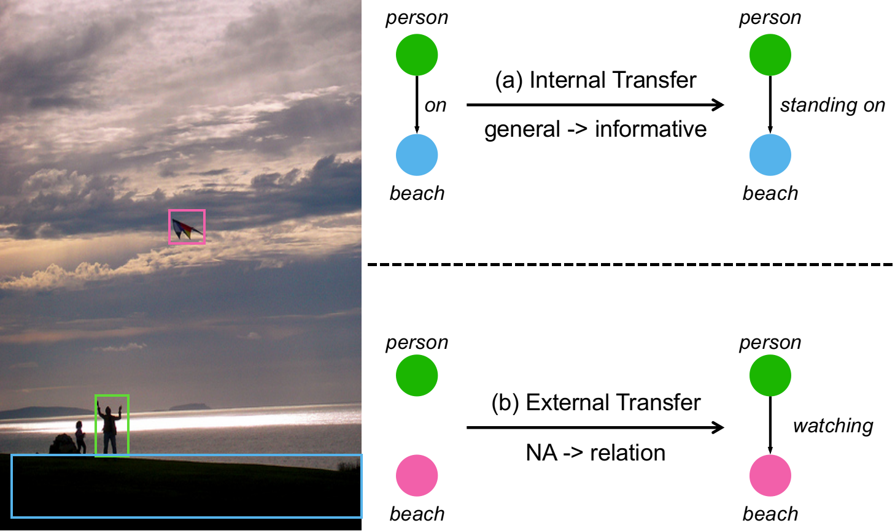
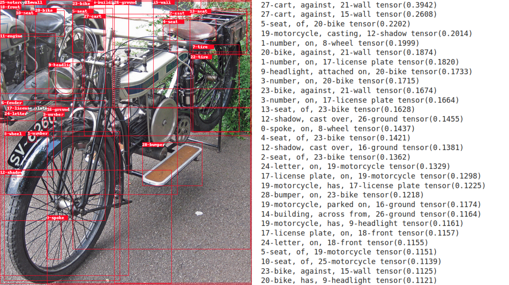

# Internal and External Data Transfer (IETrans) for Scene Graph Generation

This is the code for **ECCV 2022 (Oral)** paper "[Fine-Grained Scene Graph Generation with Data Transfer](https://arxiv.org/abs/2203.11654)".
Our paper get (1, 1, 2) from reviewers which is near to full marks (1, 1, 1).

## Recent Updates
- [x] 2022.03.19 Initialize VG-50 code.
- [x] 2022.07.19 Update VG-1800 code and dataset.
- [x] 2022.03.19 Add demo at [DEMO.md](DEMO.md).

## Quick links

* [Overview](#overview)
* [Install](#install)
* [Dataset](#dataset)
* [Object Detector](#object-detector)
* [IETrans](#ietrans)
    * [Preparation](#preparation)
    * [VG-50-Training](#vg-50-training)
    * [VG-1800-Training](#vg-1800-training)
* [Demo](#demo)
* [Tips](#tips)
* [Bugs or questions?](#bugs-or-questions)
* [Citation](#citation)
* [Acknowledgement](#acknowledgement)

## Overview


Internal Transfer: transfer data from general predicate categories (e.g. _on_) to informative ones (e.g. _riding on_).  
External Transfer: relabel unannoated data.

## Install
Please refer to [INSTALL](INSTALL.md).

## Dataset
Please refer to [DATASET](DATASET.md).


## Object Detector

### Download Pre-trained Detector

In generally SGG tasks, the detector is pre-trained on the object bounding box annotations on training set. We directly use the [pre-trained Faster R-CNN](https://onedrive.live.com/embed?cid=22376FFAD72C4B64&resid=22376FFAD72C4B64%21779870&authkey=AH5CPVb9g5E67iQ) provided by [Scene-Graph-Benchmark.pytorch](https://github.com/KaihuaTang/Scene-Graph-Benchmark.pytorch), because our 20 category setting and their 50 category setting have the same training set.

After you download the [Faster R-CNN model](https://onedrive.live.com/embed?cid=22376FFAD72C4B64&resid=22376FFAD72C4B64%21779870&authkey=AH5CPVb9g5E67iQ), please extract all the files to the directory `/home/username/checkpoints/pretrained_faster_rcnn`. To train your own Faster R-CNN model, please follow the next section.

The above pre-trained Faster R-CNN model achives 38.52/26.35/28.14 mAp on VG train/val/test set respectively.

### Pre-train Your Own Detector

In this work, we do not modify the Faster R-CNN part. The training process can be referred to the [origin code](https://github.com/KaihuaTang/Scene-Graph-Benchmark.pytorch/blob/master/README.md).

## IETrans

All commands of training are saved in the directory `cmds/`. The directory of `cmds` looks like:

```python
cmds/  
├── 50 
│   └── motif
│       ├── predcls
│       │   ├── lt \\ training to cope with long-tail distribution
│       │   │   ├── combine
│       │   │   │   │──combine.sh
│       │   │   │   │──train.sh
│       │   │   │   │──train_rwt.sh
│       │   │   ├── external
│       │   │   │   │──relabel.sh
│       │   │   ├── internal
│       │   │   │   │──relabel.sh
│       │   └── sup
│       │       ├── train.sh
│       │       └── val.sh
│       │
│       ├── sgcls
│       │   ...
│       │
│       ├── sgdet
│       │   ...

```

Generally, we first train a normal supervised model, and then use this model to relabel existing dataset (**IETrans**).

All checkpoints can be downloaded from [MODEL_ZOO.md](MODEL_ZOO.md).

### Preparation

Before running the code, you need to specify the current path as environment variable `SG` and the experiments' root directory as `EXP`.

```sh
# specify current directory as SG, e.g.:
export SG=~/IETrans-SGG.pytorch
# specify experiment directory, e.g.:
export EXP=~/exps
```


### VG-50-Training
For our pre-trained models and enhanced datasets, please refer to [MODEL_ZOO.md](MODEL_ZOO.md)

1. PREDCLS

```sh
bash cmds/50/motif/predcls/predcls.sh # run a sinlge command for all things
```

You can also run step by step:

```sh
# train a supervised model
bash cmds/50/motif/predcls/sup/train.sh
# conduct internal transfer
bash cmds/50/motif/predcls/lt/internal/relabel.sh
# conduct external transfer
bash cmds/50/motif/predcls/lt/external/relabel.sh
# combine internal and external transferred data
bash cmds/50/motif/predcls/lt/combine/combine.sh

# train a new model
bash cmds/50/motif/predcls/lt/combine/train.sh

# train a new model using rwt
bash cmds/50/motif/predcls/lt/combine/train_rwt.sh
```

The key for rwt is `IETRANS.RWT True` and `WSUPERVISE.LOSS_TYPE  ce_rwt`.

To evaluate a trained model.
```sh
bash cmds/50/motif/predcls/lt/combine/val.sh
```
Do not forget to specify the **OUTPUT_PATH** in **val.sh** as the path to the model directory you want to evaluate.


Note that the `motif` can replaced with other models we provide (e.g. `gpsnet`, `vctree`, and `transformer`).


2. SGCLS

```sh
bash cmds/50/motif/sgcls/lt/combine/train_rwt.sh
```

3. SGDET

```sh
bash cmds/50/motif/sgdet/lt/combine/train_rwt.sh
```

### VG-1800-Training
The overall training is similar with VG-50.

1. PREDCLS

```sh
bash cmds/1000/motif/predcls.sh
```

2. SGCLS

```sh
bash cmds/1000/motif/sgcls/lt/combine/train_0.1.sh # 0.1 indicates the internal transfer percentage (k_I)
# or
bash cmds/1000/motif/sgcls/lt/combine/train_0.9.sh
```

3. Evaluation

First go to the **OUTPUT_PATH** of your model.
```sh
cd $OUTPUT_PATH/inference/1000VG_stanford_filtered_with_attribute_test
cp $SG/tools/vg1800/eval.py ./
python eval.py # the script will output obj, predicate and rel accs.
```

## Demo

Please refer to [DEMO.md](DEMO.md) for more details.


## Tips
Some tips about this project. Please refer to [TIPS](TIPS.md).


## Bugs or questions?
If you have any questions related to the code or the paper, feel free to email Ao Zhang (`zhanga6@outlook.com`). If you encounter any problems when using the code, or want to report a bug, you can open an issue. Please try to specify the problem with details so we can help you better and quicker!


## Citation
If you find this work helpful, please kindly consider citing our paper in your work.
```
@inproceedings{zhang2022fine,
  title={Fine-Grained Scene Graph Generation with Data Transfer},
  author={Zhang, Ao and Yao, Yuan and Chen, Qianyu and Ji, Wei and Liu, Zhiyuan and Sun, Maosong and Chua, Tat-Seng},
  booktitle= "ECCV",
  year={2022}
}
```


## Acknowledgement
The code is built on [Scene-Graph-Benchmark.pytorch](https://github.com/KaihuaTang/Scene-Graph-Benchmark.pytorch), [VisualDS](https://github.com/thunlp/VisualDS), and [BGNN](https://github.com/SHTUPLUS/PySGG)
Thanks for their excellent codes.

